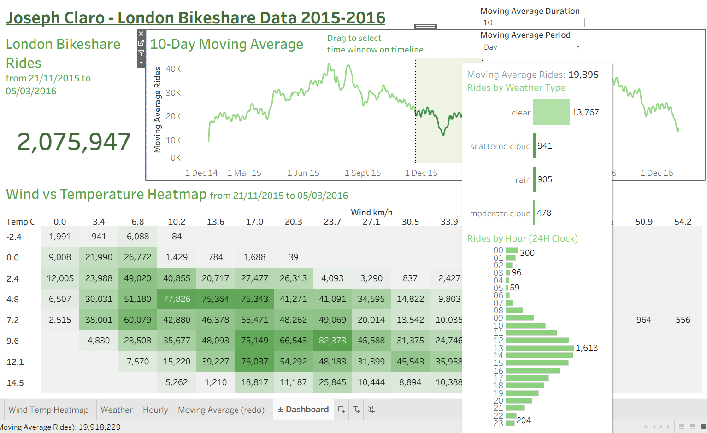

**Tableau Dashboard - London Bikesharing**

I explored and cleaned a London bikeshare dataset in Python, and presented the data on a dashboard which features an interactive moving-average line graph, where a time window can be selected to focus on information (wind speed, temperature, ride times etc.) within a start and end date.

The original dataset for this project can be found here: https://www.kaggle.com/datasets/hmavrodiev/london-bike-sharing-dataset

